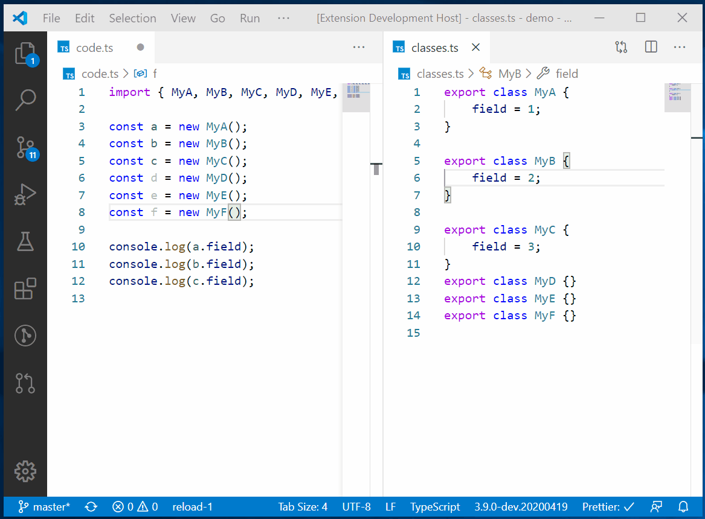
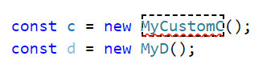
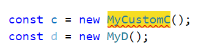
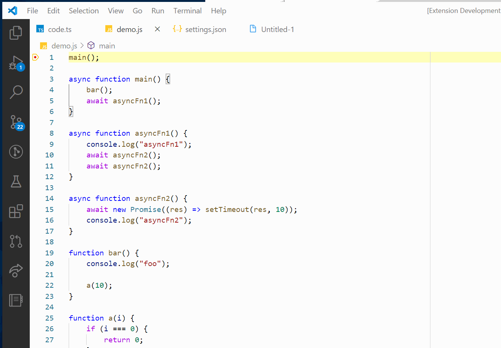
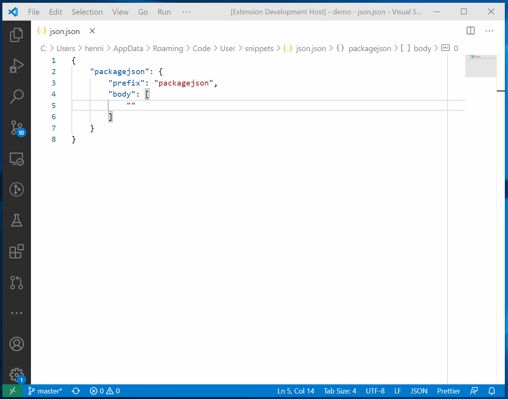
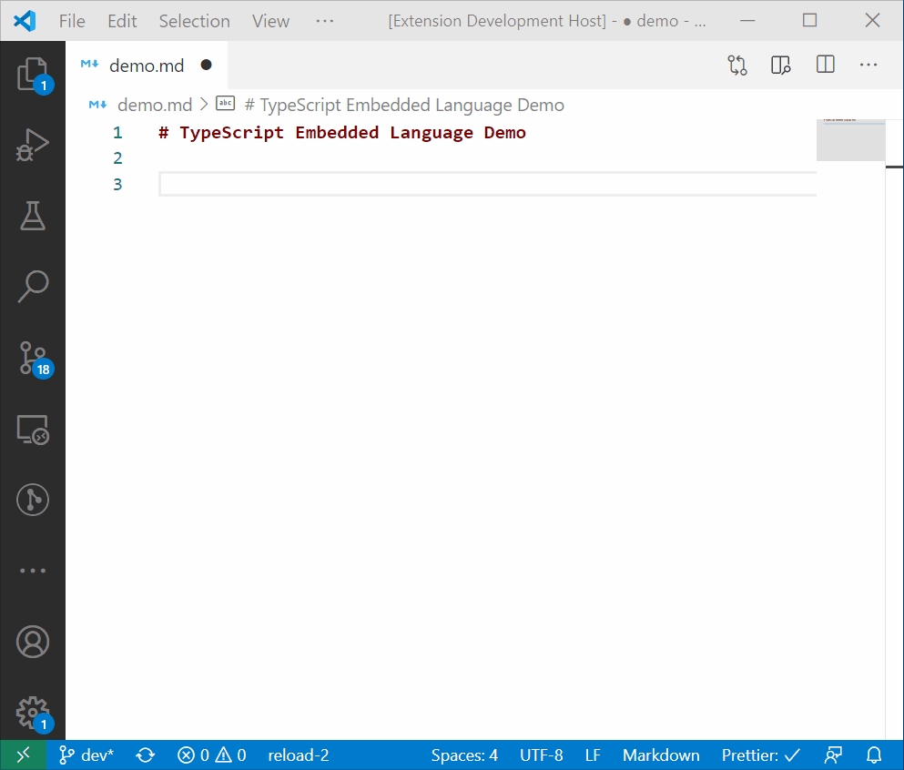

# Hediet Power Tools

This extension bundles various features that each are too small for a successful extension.

All features can be turned on and off individually!

## Provided Features (Turned On By Default)

### Apply Rename

Renames identifiers after you already changed them. Bound to shift+enter if identifier at cursor has changed.

This is incredible useful if combined with other multi cursor features. Should work for every language that has rename and word highlighting capabilities.

  
<b>Settings</b>

  
-   `hediet-power-tools.applyRename.theme`: Configures a theme.

    -   `dashed`:

        
    -   `colored`:

        

 

_Use `"hediet-power-tools.applyRename.enabled": false` to disable this feature._
 

---

### Stack Frame Line Highlighter

By default, VS Code only highlights the currently executed line when debugging.
This feature also highlights all other lines in the call stack!

 

_Use `"hediet-power-tools.stackFrameLineHighlighter.enabled": false` to disable this feature._
 

---

### JSON Escape Assistant

The JSON Escape Assistant offers the following features:

-   Shows the unescaped value when hovering over a string in a JSON document
-   Provides options to copy and paste the unescaped values (_copy_ / _paste_ in the hover menu)
-   Provides a virtual unescaped string editor (_edit_ in the hover menu)

 

_Use `"hediet-power-tools.jsonEscapeAssistant.enabled": false` to disable this feature._

## Additional Features (Turned Off By Default)

### Rich Language Features in Markdown Code Blocks

This feature brings advanced language features to markdown code blocks:

-   Auto Completion
-   Error Highlighting
-   Go To Definition

Internally, for a `xyz` code block, the extension creates a hidden `.xyz` document and forwards these language service requests to that document. Positions are translated accordingly.
This feature is still experimental and might be moved to its own extension in the future.

 

_Use `"hediet-power-tools.markdownCodeBlockLanguageService.enabled": true` to enable this feature._

---

### Custom Definitions

Add `/* def */` before an identifier and VS Code will treat this identifier as definition for all equal identifiers.
Useful if TypeScript screws up and gets the types wrong.

_Use `"hediet-power-tools.customDefinitions.enabled": true` to enable this feature._

---

### DAP Logger

Adds an output channel that logs all messages from and to the debug adapter.
Useful for debugging or evaluating what you can do with it.

_Use `"hediet-power-tools.debugAdapterLogger.enabled": true` to enable this feature._

## Planned Features (Not Implemented Yet)

-   Extend all selections until a selected character is found (inspired by `yo1dog.multi-cursor-search`).
-   Replace all selections with the result of a javascript function (inspired by `map-replace.js`).
-   Log Point Assistant
